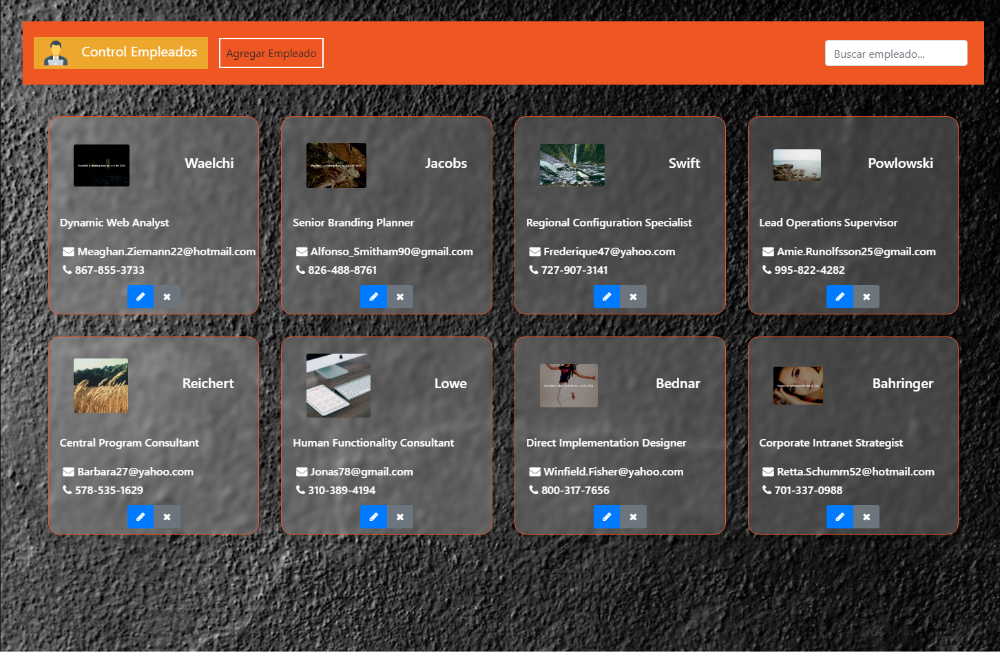

# Control de emmpleados / Employee Manager

_Se realiza app web para carga de empleados_
_Cuenta con un buscador por texto, carga, actualización y eliminación de registros_
_En cuanto a lo visual se utilizo técnica de Glassmorphism y efecto parallax_
_Backend creado bajo java springboot v2.3.1_
_Frontend creado bajo Angular v13.1.3_
_Base de datos MySql, administrada bajo DBeaver_
 
 [![]employeemanagerapp-master/employeemanagerapp-master/src/assets/modal.png)]()
 [![]employeemanagerapp-master/employeemanagerapp-master/src/assets/java.png)]() 
 [![]employeemanagerapp-master/employeemanagerapp-master/src/assets/db-empleados.png)]()
 
